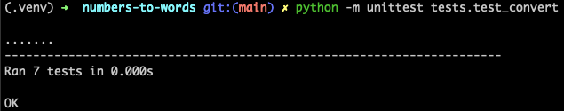
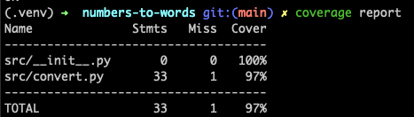

# Numbers to Words Converter
## Overview
The Numbers to Words Converter is a Python project that converts a given number (ranging from 0 to 100,000) into its English word representation. This project is organized into different modules for ease of maintenance and testing.

## Project Structure
The project is structured as follows:

```
.
├── README.md              # Project overview and documentation.
├── bin
│   └── numbers-to-words   # Executable script to convert numbers to words.
├── images
│   ├── Coverage.png       # Screenshot of code coverage report.
│   └── Test.png           # Screenshot of test results or test coverage.
├── requirements.txt       # Lists the dependencies required to run the project (e.g. coverage).
├── src
│   ├── __init__.py        # Marks the directory as a Python package.
│   └── convert.py         # Main code for converting numbers to words.
└── tests
    └── test_convert.py     # Unit tests for the `convert.py` module.
```

## Requirements
- Python 3.13+
- pip
To use a virtual environment, run:
```
python3 -m venv .venv
source .venv/bin/activate
```

To install the required dependencies, run:
```
pip install -r requirements.txt
```

## Usage
The `numbers-to-words` script is located in the bin directory and can be run from the command line. 
To convert a number to words, run the script as follows:

```
./bin/numbers-to-words [number]
```

#### Example input:

```
./bin/numbers-to-words 12345
```
#### Example output:

```
twelve thousand three hundred forty-five
```
## Exit Codes: 
`0`: Successful execution.

`1`: Invalid input (e.g., non-integer input or numbers out of the supported range).

## How it works
The `src/convert.py` module contains the core logic for converting numbers into words.
The `bin/numbers-to-words` script handles input validation, error handling, and output, making use of sys.stdin, sys.stdout, and sys.stderr for standard input/output operations.
The `tests/test_convert.py` file includes unit tests to ensure the conversion logic works as expected.

## Running tests
To run the tests, ensure you have `pytest` installed and run the following command:
```
python -m unittest tests.test_convert
```



To see the coverage:

```
coverage report
```



-> The rules for naming numbers can be ambiguous; however, the implementation follows the examples provided in the test specifications.

-> Inputs with commas are not handled, as the specification states that the input will be an integer. However, in the future, support for comma-separated values and floating-point numbers could be added.